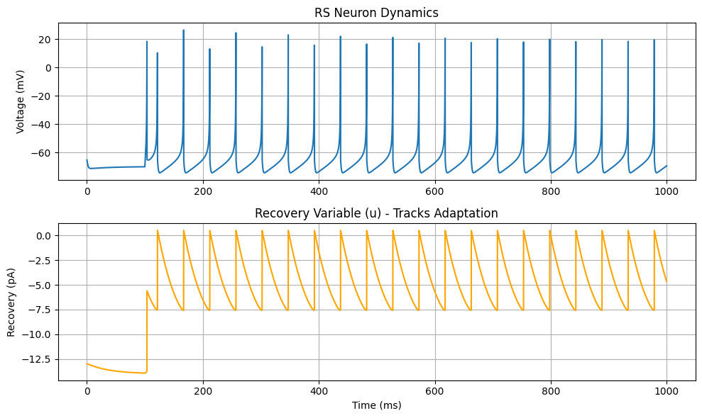
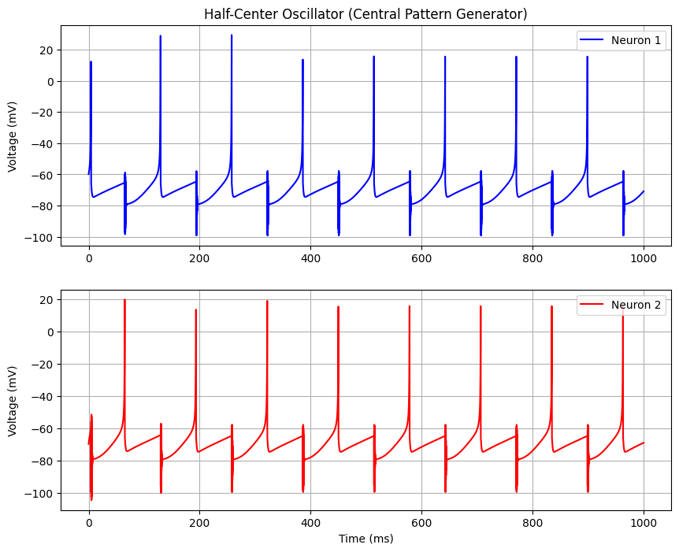

Project: Spiking Neural Network from Scratch

A first-principles implementation of Neuronal Dynamics in Python. The code features:

Izhikevich Model: Implementation of a single neuron simulating three different spiking behaviors (RS, FS, CH).

Synaptic Physics: Conductance-based synaptic dynamics for a two-neuron system.

Emergent Behavior: A Half-Center Oscillator system created by mutual inhibition between two neurons.

